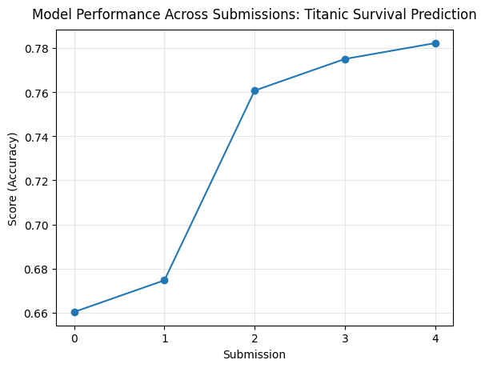

# Titanic Survival Prediction


Cette [compétition Kaggle](https://www.kaggle.com/competitions/titanic/overview) est connue pour être une bonne introduction aux compétitions sur la plateforme. 


## Objectif de ce projet
L'objectif sera de mettre en place un modèle d'estimation de la survie des passagers du navire en fonction de certains paramètres :
1. Analyse statistique des jeux de données et décision de la stratégie de préparation des données
2. Mise en place d'une pipeline de préparation des données qui sera in fine externalisée dans un fichier python dédié
3. Mise en place d'une pipeline de génération d'un output à soumettre sur la plateforme

## Sources
1. [Données de la compétition](https://www.kaggle.com/competitions/titanic/overview)
1. [Données sur le navire et ses occupants](https://www.encyclopedia-titanica.org/)
 et en particulier les informations sur le plan et les passagers.
1. [Bibliothèque SkLearn](https://scikit-learn.org/stable/)
1. [Bibliothèque Pandas](https://pandas.pydata.org/docs/)

Source des images : 
* Image du Titanic : www.encyclopedia-titanica.org
* "Capture d'écran 2025-10-22 082825" : https://upload.wikimedia.org/wikipedia/commons/f/fd/RMS_Titanic_3.jpg

Sources des Ponts : 
* https://www.encyclopedia-titanica.org/titanic-deckplans/c-deck.html
* https://www.norwayheritage.com/gallery/gallery.asp?action=viewimage&categoryid=6&text=&imageid=1825&box=&shownew=
* https://upload.wikimedia.org/wikipedia/commons/6/6e/St%C3%B6wer_Titanic.jpg

## Soumission
```kaggle competitions submit -c titanic -f submission.csv -m "Message"```

## Résultats
Actuellement cinq soumissions.
La meilleure se classe 2869ème pour une exactitude (accuracy) de 0.78229



## To Do
